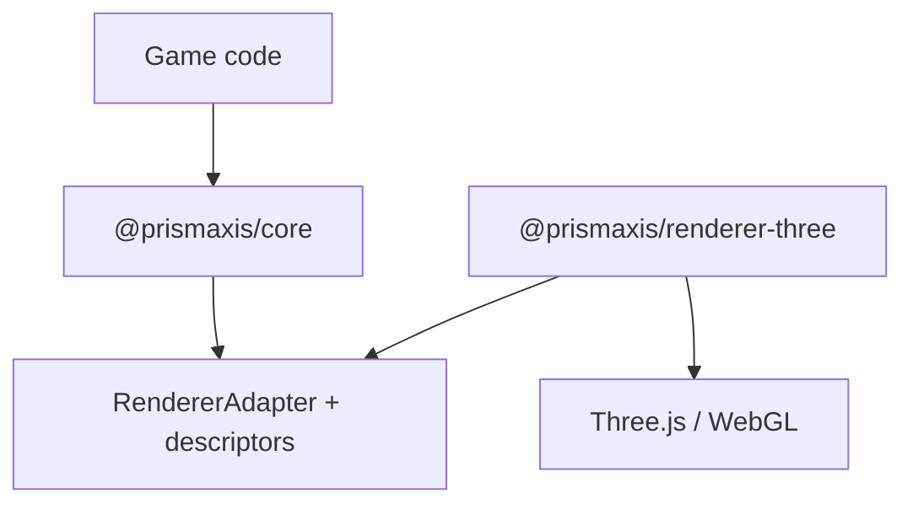

# PrismAxis.js Architecture

## Goals

The MVP establishes a small, runnable engine kernel without locking game code to
Three.js. It favors explicit ownership and understandable control flow over a large
framework or premature editor infrastructure.

## Core and Renderer Separation

`@prismaxis/core` contains no imports from Three.js. It exposes plain math values,
serializable renderer descriptors, and opaque renderer handles. The core creates and
updates those handles only through `RendererAdapter`.

Each GameObject receives a renderer group node. Renderable components create child
nodes under that group. This makes Transform hierarchy synchronization independent
from camera, light, or mesh implementation details.

The adapter boundary currently supports groups, perspective cameras, ambient and
directional lights, and primitive standard-material meshes. A future renderer can
implement the same contract without exposing backend objects to game code.

## GameObject and Component Model

Every `GameObject` has:

- a unique runtime ID and mutable name;
- an unremovable `Transform`;
- local and hierarchy-derived active state;
- zero or more additional components;
- parent/child links;
- a set of tags;
- optional Scene ownership.

`addComponent` constructs, attaches, and returns a component. `getComponent` and
`getComponents` use class identity and include subclasses. Removing a component
destroys it. Destroying a GameObject recursively destroys children and components.

Cross-scene parenting and hierarchy cycles are rejected with explicit errors.
Reparenting preserves world transform by default.

## Lifecycle

`Behaviour` owns internal one-shot flags for `awake` and `start`.

1. `Scene.initialize` invokes `awake` once and reconciles enabled state.
2. `onEnable` runs when the initialized Scene, hierarchy, and component are active.
3. `start` runs immediately before the Behaviour's first update phase.
4. `fixedUpdate`, `update`, and `lateUpdate` are dispatched by Scene.
5. Active-state changes invoke `onEnable` or `onDisable`.
6. Destruction invokes `onDisable` when necessary, then `onDestroy` once.

An inactive GameObject or disabled Behaviour is skipped. Components added after
initialization enter the same lifecycle reconciliation path.

## Game Loop

`Engine.start` initializes the renderer once, initializes the Scene, performs an
initial resize/synchronization, and schedules `requestAnimationFrame`.

For each animation frame:

1. clamp and record variable `deltaTime`;
2. consume fixed-size steps up to `maxFixedSteps`;
3. call Scene `update`;
4. call Scene `lateUpdate`;
5. reconcile renderer nodes and descriptors;
6. render through the main active camera;
7. schedule the next frame.

The bounded fixed-step accumulator avoids a simulation spiral after a stalled tab.
Pause cancels the pending frame and resume resets the timestamp, so paused wall time
does not become a large game delta. Stop is restartable; destroy is final.

`AnimationFrameScheduler` is injectable, which keeps loop tests deterministic in
Node.js.

## Transform Hierarchy

The core owns lightweight `Vector3` and `Quaternion` classes. No Three.js math type
appears in the public core API.

Local position, XYZ Euler rotation, and scale are stored directly. World position,
rotation, quaternion, scale, and a column-major matrix are calculated from the
parent chain. Position composition accounts for parent scale and rotation.

For the MVP, `position`, `rotation`, and `scale` alias the local values so mutation
such as `transform.position.set(...)` remains simple and allocation-free.
World-space mutation helpers can be added later without changing renderer ownership.

## Resource Destruction

Ownership is explicit:

- Scene owns GameObject membership.
- GameObject owns child hierarchy and components.
- Engine owns renderer handles and resize listeners.
- Renderer adapters own backend scenes, nodes, geometries, materials, and contexts.

Engine destroys component nodes before GameObject group nodes, then the renderer
scene, then the adapter. `ThreeRenderer` disposes geometries and materials and
releases its WebGL context. Repeated destruction is safe.

## Serialization

`Scene.toJSON`, `GameObject.toJSON`, and built-in component `toJSON` methods produce
plain data. Runtime references, renderer handles, and backend objects are excluded.

The current output is a snapshot, not a stable scene-file format. Deserialization,
component type IDs, schema versions, asset references, and migration rules are
deferred until the Prefab/scene-file phase.

## Future Editor Connection

The editor should communicate with core objects through stable IDs, serializable
property metadata, and commands. The planned boundary is:

- a reflection/property-schema registry for Inspector fields;
- command objects for undo/redo;
- selection and hierarchy events;
- a renderer overlay API for gizmos;
- scene serialization with schema versions.

The editor package must not reach into Three.js objects. Backend-specific debug
views should be optional renderer extensions.

## Future Rapier Integration

`@prismaxis/physics-rapier` will implement a physics-world service that advances
from fixed updates. `Rigidbody`, `Collider`, and trigger components will exchange
plain transforms and collision events with core. Rapier WASM objects remain owned
inside the physics package, similar to renderer handles.

Transform authority must be explicit: dynamic bodies write simulation poses back to
Transforms, while kinematic/static bodies push authored poses into Rapier.

## Plugin Direction

A future plugin API should register capabilities rather than mutate engine internals.
Candidate extension points include:

- component types and serialization schemas;
- Engine startup/shutdown services;
- fixed and variable update systems;
- asset loaders and importers;
- renderer and editor extensions;
- build/export hooks.

Plugin ordering, version compatibility, failure isolation, and permission boundaries
must be designed before third-party loading is enabled.

## Intentionally Deferred

The MVP intentionally does not implement:

- asset loading, caching, glTF, textures, animation, or audio;
- Prefab and stable scene-file deserialization;
- physics or collision components;
- a visual editor and undo/redo;
- custom shaders, post-processing, render pipelines, or multiple render targets;
- input mapping, networking, scripting hot reload, or ECS;
- npm publication, PWA export, and single-HTML builds.

These omissions keep Phase 1 focused on a tested runtime seam that later systems can
extend.
